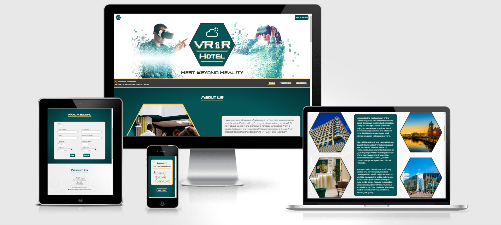

# **VR & R Hotel Website**

This is the documentation for the VR & R Hotel website. A fictitious company offering its customers a budget capsule hotel experience with a unique virtual reality twist. The project was designed as part of the Code Institute Level 5 Diploma in Web Application Development course.

[Click here to view VR & R Hotel live project](https://andywright360.github.io/VR-and-R-Hotel/)

**By Andrew Wright**

---

## **Contents**

---

- [**VR \& R Hotel Website**](#vr--r-hotel-website)
  - [**Contents**](#contents)
  - [**User Experience (UX)**](#user-experience-ux)
    - [**Initial Concept**](#initial-concept)
    - [**User Stories**](#user-stories)
  - [**Design**](#design)
    - [**Colour Scheme**](#colour-scheme)
      - [**Primary Colours**](#primary-colours)
      - [**Additional Colours**](#additional-colours)
    - [**Typography**](#typography)
      - [**Glitch Inside**](#glitch-inside)
      - [**Orbitron**](#orbitron)
      - [**Creepster**](#creepster)
    - [**Imagery**](#imagery)
    - [**Wireframes**](#wireframes)
  - [**Features**](#features)
    - [**General Features**](#general-features)
      - [**Responsive Design**](#responsive-design)
      - [**Images**](#images)
      - [**Header**](#header)
      - [**Footer**](#footer)
    - [**Home Page**](#home-page)
      - [**Hero Image**](#hero-image)
      - [**About Us**](#about-us)
      - [**Our VR Experience**](#our-vr-experience)
      - [**Become A Member**](#become-a-member)
      - [**Coming Soon**](#coming-soon)
    - [**Facilities Page**](#facilities-page)
      - [**Hero Image**](#hero-image-1)
      - [**The Hotel**](#the-hotel)
      - [**Single Capsule**](#single-capsule)
      - [**Double Capsule**](#double-capsule)
      - [**The VR Lounge**](#the-vr-lounge)
    - [**Booking Page**](#booking-page)
      - [**Hero Image**](#hero-image-2)
      - [**Make A Booking With Us**](#make-a-booking-with-us)
      - [**Contact Us**](#contact-us)
      - [**Where To Find Us**](#where-to-find-us)
      - [**Terms \& Conditions**](#terms--conditions)
    - [**Future Implementations**](#future-implementations)
      - [**Restaurant**](#restaurant)
      - [**Sign Up \& Login**](#sign-up--login)
      - [**Members Page**](#members-page)
  - [**Technologies Used**](#technologies-used)
    - [**Languages Used**](#languages-used)
    - [**Frameworks, Libraries \& Programs Used**](#frameworks-libraries--programs-used)
  - [**Deployment \& Local Development**](#deployment--local-development)
    - [**Deployment**](#deployment)
    - [**Local Development**](#local-development)
  - [**Testing**](#testing)
  - [**Credits**](#credits)
    - [Code Used](#code-used)
    - [Content](#content)
    - [Media](#media)
    - [Acknowledgments](#acknowledgments)

---

## **User Experience (UX)**

---

### **Initial Concept**

The idea behind this project was to create a business website for a Capsule Hotel based in Cardiff Wales. The hotel offers it's guests a virtual reality experience to provide a unique selling point. The design of the site is intended to highlight the technological side of the business. Selling the idea of a futuristic concept.

### **User Stories**

- **Client Goals**
  1. Provide a clear understanding of the website's purpose.
  2. Clearly identify the unique selling element to users.
  3. Entice users to make a booking.
  4. Create a strong brand identity through consistent design.
  5. Allow the website to be viewed on a variety od screen sizes.

- **First Time Visitor Goals**
  1. Learn about the Hotel and VR experience offered.
  2. Easily navigate the website and find the information required.
  3. Make a booking.

- **Returning Visitor Goals**
  1. Register for membership.
  2. Sign up to the newsletter.
  3. Follow the social media accounts.

- **Frequent User Goals**
  1. Check the Loyalty Achievements reward system.
  2. Discover new site content and updates.

---

## **Design**

---

### **Colour Scheme**

#### **Primary Colours**

These are the colours used throughout the website. The intention was to have two lighter colours and two darker colours that could be mixed and matched while still complementing one another.

#### **Additional Colours**

These are the additional colours used. These were incorporated as a hover effect for buttons, theming the Halloween event and placeholder text.

### **Typography**

#### **Glitch Inside**

Glitch Inside was used for the company logo and also the headings. It was chosen as a visual representation of the virtual reality element of the business.

#### **Orbitron**

Google Fonts 'Orbitron' was the font used throughout the body of the website. It was chosen to envoke the idea that the concept is futuristic.

#### **Creepster**

Google Fonts 'Creepster' was the font used for the Coming Soon section of the home page. It was used to style the upcoming Halloween themed event.

### **Imagery**

### **Wireframes**

All wireframes were created using Balsamiq for the following screen sizes:

- **Desktop**
  - [Home page](assets/wireframes/home-desktop.png)
  - [Facilities page](assets/wireframes/facilities-desktop.png)
  - [Capsules page](assets/wireframes/capsules-desktop.png)
  - [Booking page](assets/wireframes/booking-desktop.png)

- **Tablet**
  - [Home page](assets/wireframes/home-tablet.png)
  - [Facilities page](assets/wireframes/facilities-tablet.png)
  - [Capsules page](assets/wireframes/capsules-tablet.png)
  - [Booking page](assets/wireframes/booking-tablet.png)

- **Phone**
  - [Home page](assets/wireframes/home-phone.png)
  - [Facilities page](assets/wireframes/facilities-phone.png)
  - [Capsules page](assets/wireframes/capsules-phone.png)
  - [Booking page](assets/wireframes/booking-phone.png)

---

## **Features**

---

### **General Features**

#### **Responsive Design**

- The layout will alter in response to the device screen width to better display the content for the user.

#### **Images**

- The images used throughout the website will be displayed within hexagonal containers. This will call back to the brand logo and design features of the hotel capsules.

#### **Header**

- Home page features a central logo to create a strong brand identifier. The colour theme of the logo is used throughout the website.
- Each page includes a unique hero image to help reinforce the associated content.
- The nav bar lists the page names to help users find the relevant information. The current page is underlined, and the titles include a hover modifier to imply interactivity.
- A call-to-action booking button is present on each page to catch the user's eye.
- The website contact details are listed on each page for ease of use.

#### **Footer**

- The address and contact details are featured on each page to allow easy discovery.
- The newsletter sign-up prompt is listed to remind users of the feature.
- The social media icons include a hover modifier to signify interactivity.

---

### **Home Page**

#### **Hero Image**

- The hero image displayed is of people wearing VR headsets, having a good time. This will help sell the experience on offer to the user.

#### **About Us**

- The content listed will advertise the unique selling element of the Hotel and help the user to visualise the experience offered.
- The corresponding image will display an example employee to indicate pleasant customer service.

#### **Our VR Experience**

- The content displayed goes into further detail to elaborate on the virtual reality aspect offered. This is designed to entice the user by listing the options available.
- The image is of an example customer having fun with a VR headset to further sell the idea of the enjoyment on offer.
- Call-to-action buttons for ‘Our Capsules!’ and ‘VR Lounge!’ are present to offer additional navigation options to users wishing to learn more about these features.

#### **Become A Member**

- The content describes the benefits offered to members to entice users to sign-up.
- An image displaying the roadmap of offers provides a visual guide to users of the membership perks.
- The accompanying ‘Rewards Legend’ image provides clarity to the offers on display.
- The call-to-action ‘Become A Member’ button features a hover modifier to convey interactivity.
- When selected a small widow will be display asking for the user's name and email. A submit button will prompt a pop-up notification message to display when pressed. This will provide user feedback of a successful sign-up.
- The sign-up section for the newsletter will encourage a potential member to also sig-up for this service. A pop-up window will display a confirmation message when the ‘subscribe’ button is selected.

#### **Coming Soon**

- This section will act as an advertisement for upcoming events and updates.
- The ‘Unrest Beyond Reality’ Halloween event is a limited time offering to encourage customers interested in this feature.
- The image icons will display further information about the experience as a hover feature. This will be for desktop displays only. Tablet and phone will display the additional information in a separate container.
- Users will be encouraged to keep up to date with the latest events by returning to the website, signing up for membership and subscribing to the newsletter.

---

### **Facilities Page**

#### **Hero Image**

- The hero image shows a row of the hotel capsules to give the user an indication of the futuristic design. This will reinforce the concept of technology being at the forefront of the companies branding.

#### **The Hotel**

- The content will go into detail of the Hotels location and provide information of the local activities and transportation on offer. This will provide potential customers with ideas to help plan their trip itinerary.
- A list of the hotel amenities will be displayed with accompanying icons to further reinforce the features.
- An image of the hotel exterior will act as an aid to potential customers visiting the location.
- An image of guests conversing around the capsules sell the idea of the experience being offered.
- Images of both the Cardiff Bay area and Cardiff City will provide highlights of the local area.

#### **Single Capsule**

- Highlights of the capsule's features are advertised to the user to encourage a booking.
- The ‘Book Now!’ is also displayed within the content area to provide a streamlined booking experience for the user.
- The amenities are listed in the same style as displayed in the facilities page to reinforce this design across the website.
- The image will provide a clear example of the capsule room. The styling of the site has been designed to mirror features of the capsule to reinforce the identity of the brand.

#### **Double Capsule**

- As the only difference between the capsule's is the number of beds. The content is displayed in the same manner only mirrored. This provides consistency across the visual layout of the page.
- The information about the double capsule offers a suggestion being suitable for both one and two guests. This allows a single guest to consider upgrading to the larger room size.
- The accompanying image displays the interior of a double deb capsule. This will convey the difference between the two capsule sizes.

#### **The VR Lounge**

- The content advertises the social lounge area provided to guests. This enriches the options available for the type of VR experiences offered.
- The accompanying images will reinforce the type of experience guests can expect from this section of the hotel.

---

### **Booking Page**

#### **Hero Image**

- The hero image shows an exciting couple making an online booking for the hotel. This is to reinforce the idea of the booking being a good and happy experience.

#### **Make A Booking With Us**

- The booking input table in laid out into two columns for wider desktop displays. This is reduced to a single column display on smaller tablet and phone displays. This provides the user with a visually appealing design regardless of the display used.
- Labels are positioned above the input windows avoid any confusion as to what information is required from the user.
- A ‘clear’ button in provided as a fast re-set to any mistakes made by the user.
*The ‘submit’ button will display a small widow with a ‘Thank you for your booking’ message. This will provide the user with feedback to confirm their booking has been successful.

#### **Contact Us**

- The contact details are displayed centrally in the page so they can be easily located.

#### **Where To Find Us**

- A Google Maps location widow will display the exact location of the hotel for ease of use.

#### **Terms & Conditions**

- The relevant policy information is all contained in this window so a user can get additional information if required.
- A scrolling window was used to display the information in a more visually appealing way.

---

### **Future Implementations**

#### **Restaurant**
The Restaurant was originally designed during my wireframes and was intended to be part of the Facilities page. However, as I began designing the website I felt that its inclusion was unnecessary for the projects scope.

This would be a section I would add at a later stage and would feature images of the restautant as well as menu items and guests enjoying the experience. It would also contain a short descriptive paragraph, an opening time table and a button link to the menu.

#### **Sign Up & Login**
I would like to include a Sign Up & Login section so that returning customers could have a smoother experience when making a booking as their details could be remembered.

#### **Members Page**
As an extension of the Login feature I would like to implement a members page which would track their progress made along the Loyalty Reward system. This page would also allow members to select the VR experinces that they most enjoyed so recommendations could be made to them for future visits.

---

## **Technologies Used**

---

### **Languages Used**

* HTML5
* CSS3

### **Frameworks, Libraries & Programs Used**

1. **Bootstrap 5.3.1:**
Bootstrap was used to help with the layout of the website and also for responsive design.

2. **Hover.css:**
Hover.css was used on the Coming Soon section of the Home page. The swipe to bottom transition was placed on the upcoming event features to reveal the content in a stylised way.

3. **Google Fonts:**
Google fonts was linked into the head section of the html pages. 'Orbitron' was the main font used throughout the project. 'Creepster' was also used in the Coming Soon section of the home page to provide a horror theme to upcoming content.

4. **Font Awesome:**
Font Awesome was used on the navigation bar and footer of each page. It also features on the amenities sections of the Facilities page. It was used to compliment the content and provide a visual representation of the information to users.

5. **Codeanywhere:**
Codeanywhere was used for version control by utilizing the terminal to commit to and push to GitHub.

1. **GitHub:**
GitHub is used to store the projects code after being pushed from Codeanywhere.

1. **Pixlr:**
Pixlr was used to create the website logo and adjust the colouring of images to better fit the colour scheme. It was also used to generate the various image shapes used throughout the website for creative design.

1. **Balsamiq:**
The wireframes were created using Balsamiq during the designing stage of the project.

---

## **Deployment & Local Development**

---

### **Deployment**

### **Local Development**

- **How to Fork**

- **How to Clone**

---

## **Testing**

---

## **Credits**

---

### Code Used

### Content

### Media

### Acknowledgments
