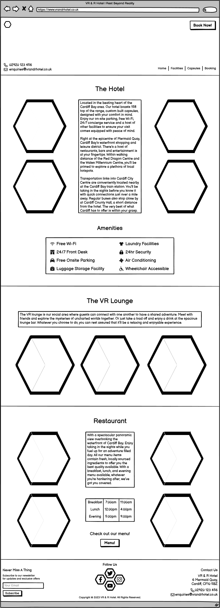
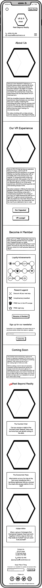
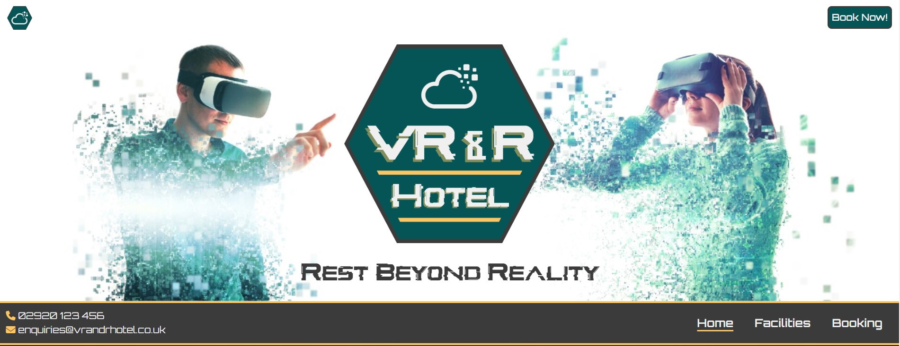
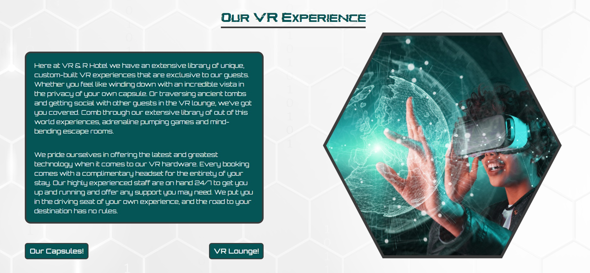
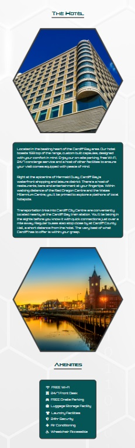

# **VR & R Hotel Website** <!-- omit in toc -->

This is the documentation for the VR & R Hotel website. A fictitious company offering its customers a budget capsule hotel experience with a unique virtual reality twist. The project was designed as part of the Code Institute Level 5 Diploma in Web Application Development course.

[Click here to view VR & R Hotel live project](https://andywright360.github.io/VR-and-R-Hotel/)

**By Andrew Wright**

---

## **Contents** <!-- omit in toc -->

- [**User Experience (UX)**](#user-experience-ux)
  - [**Initial Concept**](#initial-concept)
  - [**User Stories**](#user-stories)
- [**Design**](#design)
  - [**Colour Scheme**](#colour-scheme)
    - [**Primary Colours**](#primary-colours)
    - [**Additional Colours**](#additional-colours)
  - [**Typography**](#typography)
    - [**Glitch Inside**](#glitch-inside)
    - [**Orbitron**](#orbitron)
    - [**Creepster**](#creepster)
  - [**Imagery**](#imagery)
  - [**Wireframes**](#wireframes)
    - [**Desktop**](#desktop)
    - [**Tablet**](#tablet)
    - [**Phone**](#phone)
- [**Features**](#features)
  - [**General Features**](#general-features)
    - [**Responsive Design**](#responsive-design)
    - [**Images**](#images)
    - [**Background**](#background)
    - [**Header**](#header)
    - [**Footer**](#footer)
  - [**Home Page**](#home-page)
    - [**Hero Image**](#hero-image)
    - [**About Us**](#about-us)
    - [**Our VR Experience**](#our-vr-experience)
    - [**Become A Member**](#become-a-member)
    - [**Coming Soon**](#coming-soon)
  - [**Facilities Page**](#facilities-page)
    - [**Hero Image**](#hero-image-1)
    - [**The Hotel**](#the-hotel)
    - [**Single Capsule**](#single-capsule)
    - [**Double Capsule**](#double-capsule)
    - [**The VR Lounge**](#the-vr-lounge)
  - [**Booking Page**](#booking-page)
    - [**Hero Image**](#hero-image-2)
    - [**Make A Booking**](#make-a-booking)
    - [**Contact Us**](#contact-us)
    - [**Where To Find Us**](#where-to-find-us)
    - [**Terms \& Conditions**](#terms--conditions)
    - [**Thank You Pages**](#thank-you-pages)
  - [**Future Implementations**](#future-implementations)
    - [**Restaurant**](#restaurant)
    - [**Sign Up \& Login**](#sign-up--login)
    - [**Members Page**](#members-page)
- [**Technologies Used**](#technologies-used)
  - [**Languages Used**](#languages-used)
  - [**Frameworks, Libraries \& Programs Used**](#frameworks-libraries--programs-used)
- [**Deployment \& Local Development**](#deployment--local-development)
  - [**Deployment**](#deployment)
  - [**Local Development**](#local-development)
    - [**How to Fork**](#how-to-fork)
    - [**How to Clone**](#how-to-clone)
- [**Testing**](#testing)
  - [**W3C HTML Validation**](#w3c-html-validation)
    - [**First Validation**](#first-validation)
    - [**Second Validation**](#second-validation)
  - [**W3C CSS Validation**](#w3c-css-validation)
  - [**WCAG Color Contrast Checker**](#wcag-color-contrast-checker)
  - [**Bugs \& Fixes**](#bugs--fixes)
  - [**Known Bugs**](#known-bugs)
  - [**Testing User Stories**](#testing-user-stories)
    - [**First Time Visitor Goals**](#first-time-visitor-goals)
    - [**Returning Visitor Goals**](#returning-visitor-goals)
    - [**Frequent User Goals**](#frequent-user-goals)
  - [**Lighthouse Testing**](#lighthouse-testing)
    - [**Home Page**](#home-page-1)
    - [**Facilities Page**](#facilities-page-1)
    - [**Booking Page**](#booking-page-1)
    - [**Thank You Pages**](#thank-you-pages-1)
    - [**Home Page - Retest**](#home-page---retest)
    - [**Facilities Page - Retest**](#facilities-page---retest)
    - [**Booking Page - Retest**](#booking-page---retest)
    - [**Thank You Pages - Retest**](#thank-you-pages---retest)
  - [Full Testing](#full-testing)
- [**Credits**](#credits)
  - [**Code Used**](#code-used)
  - [**Content**](#content)
  - [**Media**](#media)
    - [**Home Page**](#home-page-2)
    - [**Facilities Page**](#facilities-page-2)
    - [**Booking Page**](#booking-page-2)
    - [**Other Images**](#other-images)
  - [Acknowledgments](#acknowledgments)

---

## **User Experience (UX)**

### **Initial Concept**

The idea behind this project was to create a business website for a Capsule Hotel based in Cardiff Wales. The hotel offers it's guests a virtual reality experience to provide a unique selling point. The design of the site is intended to highlight the technological side of the business. Selling the idea of a futuristic concept.

### **User Stories**

- **Client Goals**
  1. Provide a clear understanding of the website's purpose.
  2. Clearly identify the unique selling element to users.
  3. Entice users to make a booking.
  4. Create a strong brand identity through consistent design.
  5. Allow the website to be viewed on a variety od screen sizes.

- **First Time Visitor Goals**
  1. Learn about the Hotel and VR experience offered.
  2. Easily navigate the website and find the information required.
  3. Make a booking.

- **Returning Visitor Goals**
  1. Register for membership.
  2. Sign up to the newsletter.
  3. Follow the social media accounts.

- **Frequent User Goals**
  1. Check the Loyalty Achievements reward system.
  2. Discover new site content and updates.

---

## **Design**

### **Colour Scheme**

#### **Primary Colours**

These are the colours used throughout the website. The intention was to have two lighter colours and two darker colours that could be mixed and matched while still complementing one another.

#### **Additional Colours**

These are the additional colours used. These were incorporated as a hover effect for buttons, theming the Halloween event and placeholder text.

### **Typography**

#### **Glitch Inside**

Glitch Inside was used for the company logo and also the headings. It was chosen as a visual representation of the virtual reality element of the business.

#### **Orbitron**

Google Fonts 'Orbitron' was the font used throughout the body of the website. It was chosen to envoke the idea that the concept is futuristic.

#### **Creepster**

Google Fonts 'Creepster' was the font used for the Coming Soon section of the home page. It was used to style the upcoming Halloween themed event.

### **Imagery**

All imagery used for the website was selected to be visually striking and adjusted using Pixlr where needed to reinforce the colour scheme. The hexagonal image shape was intended to reflex the idea of futuristic technology and to apply a consistant visual theme.

### **Wireframes**

All wireframes were created using Balsamiq for the following screen sizes:

#### **Desktop**

Home Page

*Home Page*

Facilities Page

*Facilities Page*

Capsules Page

*Capsules Page*

Booking Page

*Booking Page*

#### **Tablet**

Home Page

*Home Page*

Facilities Page

*Facilities Page*

Capsules Page

*Capsules Page*

Booking Page

*Booking Page*

#### **Phone**

Home Page

*Home Page*

Facilities Page

*Facilities Page*

Capsules Page

*Capsules Page*

Booking Page

*Booking Page*

---

## **Features**

### **General Features**

#### **Responsive Design**

Screenshots

*Responsive Design*

- The layout will alter in response to the device screen width to better display the content for the user.
- Responsive design was something that I was very mindful of when planning the layout of each section across device sizes.

#### **Images**

Screenshots

*Hexagonal Image Design*

- The images used throughout the website are hexagonally shaped. This will call back to the brand logo and design features of the hotel capsules.

#### **Background**

Screenshots

*Teal Background - Gradient*

*White Hex Background - Position: Fixed*

 - The descision was made to alternate the background colours of each section from teal and white. This was to give the user a strong indication of where each section ends.
 - I added a gradient to the edge of the teal background to make it more dynamic. It originally looked a little flat when compared to the background image used in the white background.
 - The white hexagonal background image was chosen to further emphasise the use of this shape throughout the website.
 - As a background image I wanted it to remain subtle and not distract the user form the page content.
 - The position fixed property was chosen to add a bit of stylistic flare to website.

#### **Header**

Screenshots

*Home page - Logo*

*Navbar - hover effect*

*Call-to-action button*

*Contact Information*

*Hamburger Icon Animation*

- Home page features a central logo to create a strong brand identifier. The colour theme of the logo is used throughout the website.
- Each page includes a unique hero image to help reinforce the associated content.
- The nav bar lists the page names to help users find the relevant information. The current page is underlined, and the titles include a hover modifier to imply interactivity.
- A call-to-action booking button is present on each page to catch the user's eye.
- The colour scheme of the call-to-action button was altered for better visibility on the Booking page.
- The website contact details are listed on each page for ease of use.
- A hamburger icon was included using BootStrap for mobile devices.
- The animation was included to give the userresponsive feedback.

#### **Footer**

Screenshots

*Footer - Contact Details*

*Footer - News Letter*

*Social Meida Icons - Hover Effect*

- The address and contact details are featured on each page to allow easy discovery.
- The newsletter sign-up prompt is listed to remind users of the feature.
- The social media icons include a hover modifier to signify interactivity.

---

### **Home Page**

#### **Hero Image**

Screenshots

*Home Page Hero Image - Desktop*

*Home Page Hero Image - Mobile*

- The hero image displayed is of people wearing VR headsets, having a good time. This will help sell the experience on offer to the user.
- A second image was created with a different aspect ratio to better suit mobile devices.

#### **About Us**

Screenshots

*About Us Section*

- The content listed will advertise the unique selling element of the Hotel and help the user to visualise the experience offered.
- The corresponding image will display a couple checking in at the reception desk. The happy expression of the receptionist will indicate to users that the check-in process is pleasant.
- The colour pallet of the original image has been altered to fit the colour theme of the business.

#### **Our VR Experience**

Screenshots

*VR Experience Section*

*VR Experience - Buttons*

- The content displayed goes into further detail to elaborate on the virtual reality aspect offered. This is designed to entice the user by listing the options available.
- The image is of an example customer having fun with a VR headset to further sell the idea of the enjoyment on offer.
- The colour pallet of the image was altered to suit the colur scheme.
- Call-to-action buttons for 'Our Capsules!' and 'VR Lounge!' are present to offer additional navigation options to users wishing to learn more about these features.
- Both buttons have a hover effect applied to indicate interactivity.

#### **Become A Member**

Screenshots

*Become A Member Section*

*Loyalty Achievements - Desktop*

*Loyalty Achievements - Mobile*

*Rewards Legend Table*

*Membership - Call To Action Button*

*Membership Sign Up Modal*

*Thank You Page - Membership*

*Thank You Page - Newsletter*

- The content describes the benefits offered to members to entice users to sign-up.
- The Loyalty Achievements image displaying the road map of offers provides a visual guide to users of the membership perks.
- The use of pixel art was chosen to associate the concept of earning rewards with unlocks in a video game.
- A modified version of the Loyalty Achievements image was created to better fit the display on mobile devices.
- The accompanying 'Rewards Legend' image provides clarity to the offers on display.
- The call-to-action 'Become A Member' button features a hover modifier to convey interactivity.
- When selected a modal will be display asking for the user's name and email. A successful submit will take the user to a seperate page diaplaying a thank you message. This will provide user feedback of a successful sign-up.
- The sign-up section for the newsletter will encourage a potential member to also sign-up for this service. A successful submission will lead the user to a seperate thank you page. This will provide the user with feedback.

#### **Coming Soon**

Screenshots

*Coming Soon Section*

*Unrest Beyong Reality - Hover Effect*

*Unrest Beyong Reality - Tablet Layout*

- This section will act as an advertisement for upcoming events and updates.
- The 'Unrest Beyond Reality' Halloween event is a limited time offering to encourage customers interested in this feature.
- The image icons will display further information about the experience as a hover feature. This will be for desktop displays only. Tablet and phone will display the additional information in a separate container.
- The colour scheme for the Unrest Beyond Reality event was made red to better match the horror theme and also seperate it from the rest of the site content.
- Users will be encouraged to keep up to date with the latest events by returning to the website, signing up for membership and subscribing to the newsletter.

---

### **Facilities Page**

#### **Hero Image**

Screenshots

*Facilities Hero Image - Desktop*

*Facilities Hero Image - Mobile*

- The hero image shows a row of the hotel capsules to give the user an indication of the futuristic design. This will reinforce the concept of technology being at the forefront of the companies branding.
- Two header images where created at different aspect ratios to better suit the display size.

#### **The Hotel**

Screenshots

*The Hotel Section - Desktop*

*The Hotel Section - Tablet*

*The Hotel Section - Mobile*

*Hotel Ameneties*

- The content will go into detail of the Hotels location and provide information of the local activities and transportation on offer. This will provide potential customers with ideas to help plan their itinerary.
- A list of the hotel amenities will be displayed with accompanying icons to further reinforce the features.
- An image of the hotel exterior will act as an aid to potential customers visiting the location.
- An image of the reception area will help users to visualise the modern interior style of the hotel.
- Images of both the Cardiff Bay area and Cardiff City will provide highlights of the local area.
- The layout of the section will alter responsively to suit the display size.

#### **Single Capsule**

Screenshots

*The Capsules Section*

*Single Capsule*

*Call-to-action Booking Button*

*Capsule Ameneties*

- Highlights of the capsule's features are advertised to the user to encourage a booking.
- The 'Book Now!' is also displayed within the content area to provide a streamlined booking experience for the user.
- The amenities are listed in the same style as displayed in the facilities page to reinforce this design across the website.
- The image will provide a clear example of the capsule room. The styling of the site has been designed to mirror features of the capsule to reinforce the identity of the brand.

#### **Double Capsule**

Screenshots

*Double Capsule*

- As the only difference between the capsule's is the number of beds. The content is displayed in the same manner only mirrored. This provides consistency across the visual layout of the page.
- The information about the double capsule offers a suggestion being suitable for both one and two guests. This allows a single guest to consider upgrading to the larger room size.
- The accompanying image displays the interior of a double deb capsule. This will convey the difference between the two capsule sizes.

#### **The VR Lounge**

Screenshots

*The VR Lounge Section - Desktop*

*The VR Lounge Section - Tablet*

*The VR Lounge Section - Mobile*

- The content advertises the social lounge area provided to guests. This enriches the options available for the type of VR experiences offered.
- The accompanying images will reinforce the type of experience guests can expect from this section of the hotel.
- The layout of this section alters dynamically to better suit the display width.

---

### **Booking Page**

#### **Hero Image**

Screenshots

*Booking Hero Image - Desktop*

*Booking Hero Image - Mobile*

*Mini Logo - Alternate Colour*

*Booking Button - Alternate Colour*

- The hero image matches the teal colour pallet used throughout the wensite.
- Two versions of the hero image are used for an improved aspect ratio depending on the display size.
- An alternate colour of the book now button and miniture logo were used to stand out against the background.

#### **Make A Booking**

Screenshots

*Booking Form - Desktop*

*Booking Form - Mobile*

*Clear Button*

*Submit Form*

- The booking input form laid out into two columns for wider desktop displays. This is reduced to a single column display on smaller tablet and phone displays. This provides the user with a visually appealing design regardless of the display used.
- Labels are positioned above the input windows to avoid any confusion as to what information is required from the user.
- A 'clear' button in provided as a fast re-set to any mistakes made by the user.
- Upon successful sumbmission of the form the user will be taken to seperate page displaying a thank you message. This is to provide the user with feedback.

#### **Contact Us**

Screenshots

*Contact Us*

- The contact details are displayed centrally in the page so they can be easily located.

#### **Where To Find Us**

Screenshots

*Where To Find Us*

- A Google Maps location widow will display the exact location of the hotel for ease of use.

#### **Terms & Conditions**

Screenshots

*Terms & Conditions*

- The relevant policy information is all contained in this window so a user can get additional information if required.
- A scrolling window was used to display the information in a more visually appealing way.

#### **Thank You Pages**

Screenshots

*Thank You Page - Header*

*Thank You Message - Booking*

*Thank You Message - Newsletter*

*Thank You Message - Membership*

- The header background image was chose to be subtle and simple but reference the hexagonal design present throughout.
- Three seperate Thank You pages where created. I wanted the design to be consistant across all pages but the measage to be unique. This is to give the user more accurate feedback on the task performed.
- The navigation bar was placed so the user can return to the page of their choice.

---

### **Future Implementations**

#### **Restaurant**

The Restaurant was originally designed during my wireframes and was intended to be part of the Facilities page. However, as I began designing the website I felt that its inclusion was unnecessary for the projects scope.

This would be a section I would add at a later stage and would feature images of the restautant as well as menu items and guests enjoying the experience. It would also contain a short descriptive paragraph, an opening time table and a button link to the menu.

#### **Sign Up & Login**

I would like to include a Sign Up & Login section so that returning customers could have a smoother experience when making a booking as their details could be remembered.

#### **Members Page**

As an extension of the Login feature I would like to implement a members page which would track their progress made along the Loyalty Reward system. This page would also allow members to select the VR experinces that they most enjoyed so recommendations could be made to them for future visits.

---

## **Technologies Used**

### **Languages Used**

- HTML5
- CSS3

### **Frameworks, Libraries & Programs Used**

1. **Bootstrap 5.3.1:**
Bootstrap was used to help with the layout of the website and also for responsive design.

2. **Hover.css:**
Hover.css was used on the Coming Soon section of the Home page. The swipe to bottom transition was placed on the upcoming event features to reveal the content in a stylised way.

3. **Google Fonts:**
Google fonts was linked into the head section of the html pages. 'Orbitron' was the main font used throughout the project. 'Creepster' was also used in the Coming Soon section of the home page to provide a horror theme to upcoming content.

4. **Font Awesome:**
Font Awesome was used on the navigation bar and footer of each page. It also features on the amenities sections of the Facilities page. It was used to compliment the content and provide a visual representation of the information to users.

5. **Codeanywhere:**
Codeanywhere was used for version control by utilizing the terminal to commit to and push to GitHub.

6. **GitHub:**
GitHub is used to store the projects code after being pushed from Codeanywhere.

7. **Pixlr:**
Pixlr was used to create the website logo and adjust the colouring of images to better fit the colour scheme. It was also used to generate the various image shapes used throughout the website for creative design.

8. **Balsamiq:**
The wireframes were created using Balsamiq during the designing stage of the project.

9. **XnConvert:**
XnConvert was used to convert all image files from JPEG and PNG to WebP.

10. **TinyPNG:**
TinyPNG was used to compress all image files to improve performance.

---

## **Deployment & Local Development**

### **Deployment**

The project was deployed to GitHub Pages. The following steps were used to achieve this:

1. Log in to Github.
2. Locate the relevant repository for this project (VR-&-R-Hotel).
3. Select the '**Settings**' tab for the chosen repository at the top of the page.
4. Click on the '**Pages**' tab from the left hand navigation menu.
5. Under '**Source**' click the drop-down menu and select the option '**Deploy from a branch**'.
6. In the '**Branch**' section, click the farthest left drop-down menu box and select the option 'main'. Select the drop-down menu box next to this and choose the option '**/(root)**'.
7. Click the '**Save**' button.
8. The live site address will display when successfully published.

### **Local Development**

#### **How to Fork**

Forking the the GutHub Repository allows for changes to be made without altering the original repository. To do this please follow the following steps:

1. Log in to Github.
2. Locate the relevant repository for this project (VR-&-R-Hotel).
3. Select the '**Fork**' button located towards the top right of the repository.
4. You should now have a copy of the original repository in your GutHub account.

#### **How to Clone**

To clone this project, please follow the steps below:

1. Log in to GitHub.
2. Locate the relevant repository for this project (VR-&-R-Hotel).
3. Click on the green '**Code**' drop-down button.
4. Select the '**Local**' tab in the window that appears.
5. Select the option '**HTTPS**' and copy the link shown.
6. Open the terminal in your IDE of choice.
7. Change the current working directory to the location you want to use for the cloned directory.
8. Type '**git clone**' into the terminal and then paste the link you copied in Step 5.
9. Press enter.

---

## **Testing**

### **W3C HTML Validation**

#### **First Validation**

Home Page

*Home Page - Initial Validation*

Facilities Page

*Facilities Page - Initial Validation*

Booking Page

*Booking Page - Initial Validation*

Thank You Page - Booking

*Thank You Page (Booking) - Initial Validation*

Thank You Page - Membership

*Thank You Page (Membership) - Initial Validation*

Thank You Page - Newsletter

*Thank You Page (Newsletter) - Initial Validation*

The initial validation for each page highlighted a consistant issue throught the website that needed correcting. As well as a few small issues in the Facilities and Booking page. The list of issues were as follows:

- Nesting a `<button>` inside an `<a>` element.

  - This was the method of navigation that I had used for many of the buttons throughout the website. My fix for this was to use a `<form>` that redirected the user upon submission. The `<button>` would then be changed to the submit input for the form.

- Facilities Page: Spelling error inside an `<a>` element.

  - Two anchor elements had a duplication of the `<a>` within the tag, so it displayed `<a a>`. This issue was also resolved by changing the `<button>` elements nested inside an `<a>` element.

- Booking Page: Unnecessary 'required' attribute inside select type `<input>` elements.

  - As the select type inputs used in the booking form had a value associated to each of the options. The 'required' attribute wasn't needed, as the first selectable option was chosen by default. My fix for this issue was to remove the 'required' attribute from these inputs.

- Booking Page: 'Required' attribute applied to `<label>` element.

  - The 'required' attribute had been applied to a form label in error. The fix for this was to remove this attribute.

#### **Second Validation**

After implimenting the changes outlined above the second validation attempt showed no errors or warnings across all pages.

### **W3C CSS Validation**

No errors were found when using the W3C CSS Validator.

### **WCAG Color Contrast Checker**

I was mindful of having a high contrast when selecting the colour scheme for the website. Below are the results oor each of the background and foreground combinations used for this project.

This is the primary colour scheme used in the navigation and footer section on each page.

This is the alternative colour scheme used in the navigation and footer section. It was applied to the hover effect of the navigation links, the font awesome icons and the headings of the footer.

This is used in the sections with the white heaxagonal background and also the text boxes.

This is the alternative colour scheme used for teal background sections and text boxes.

This is used in the Unrest Beyond Reality section of the home page.

### **Bugs & Fixes**

Navigation Bar Position Change

*Navigation Bar - Bug*

*Navigation Bar - Fix*

The reason for this issue was that the heading section of the home page contained the company logo and slogan header. Whereas the other pages were just a hero image. Because the logo and slogan were responsive the size of the home page heading was relative to the display width. This made it challenging to keep the navbar at a consistant position across all pages.

The fix I implemented was to include the logo image and slogan header across all heading sections of the website.However, on the facilities and booking page I applied the BootStrap 'invisible' class to the rows containing the content. This allows the headings sections to be consistant across all pages without displaying the unwanted content. `
`

Booking Form Input Alignment

*Booking Form - Bug*

*Booking Form - Fix*

This bug was caused by having a single input within the top row of the form but all other rows having two inputs. Because of this it was difficult to align the 'Title' select box with the remaining inputs. With the spacing method of 'justify-content-evenly' being responsive. The alignment became more noticable on wider displays.

The fix I implemented was similar to the previous bug fix. I added an additional input to the top row but added the 'invisible' class to prevent it being dispayed. This allowed me to apply the same spacing method of 'justift-content-evenly' to the row and have the alignment match the other content exactly.

iPhone Text Decoration Not Displaying

*Text Decoration - Bug*

*Text Decoration - Fix*

The CSS 'text-decoration' property wasn't displaying on iPhone devices.

By including the additional line of `-webkit-text-decoration` to my CSS I was able to rectify this issue. However, the 'text-decoration' colour of the current webpage was displays as white instead of yellow. I was happy to leave this as it was a small detail that only effected the navbar.

Readme Table of Contents Issue

*Table of Contents - Bug*

*Table of Contents - Fix*

This issue was caused by the table of contents section of the readme file being auto generated. This caused every heading on the page to be listed, including the page title which wasn't wanted.

After reporting my problem to the Slack community 'Laurie Crean' was able to suggest a fix. By applying `<!-- omit in toc -->` to the headings that I didn't want in the table of contents. They weren't targeted by the auto generation algorithm.

### **Known Bugs**

Upon viewing the website on an iPhone held horizontally, the screen displays with a border. I'm not sure why this happens and have been unable to find a fix.

The hexagonal containers used for the social media icons in the footer don't display correctly on firefox. It causes the border of the coantainer to be uneven. This is particularly noticable as the display is re-sized. I'm unsure of a possible fix to this.

### **Testing User Stories**

#### **First Time Visitor Goals**

1.) Learn about the Hotel and VR experience offered.

Screenshots

*Home Page Content*

*VR Experience - Navigation Buttons*

- The first section of the home page is the 'About Us' section. This was to allow users to imediately get a clear understanding of the websites purpose.
- The second section then goes into further detail of the 'VR Experience' offered.
- This section also contains button links to allow users to easily navigate to specific information discussed in the text box.

2.) Easily navigate the website and find the information required.

Screenshots

*Navigation Bar*

*Call-to-action Button - Header*

*Call-to-action Button - Capsules*

- To ensure that navigation of the website was intuitive I applied a colour changing hover effect to the navigation bar.
- This was to provide feedback to user and imply that the feature was interactive.
- The current page displays underlined text so the user is aware of their location within the website.
- Call-to-action buttons have been placed throughout the website to allow easier navigation options to users. 

3.) Make a booking.

Screenshots

*Book Now! Button - Header*

*Book Now! Button - Capsules Section*

*Bokking Page - Navbar*

*Bokking Form - Clear*

*Booking Form - Submit*

- The call-to-action 'Book Now!' button is placed at the top of each page to allow easy navigation.
- Call-to-action buttons have also been placed in the Capsules section so users can make a booking after learning more about them.
- 'Booking' was the tiltle given to the booking page to clearly communicate the purpose of the page to users.
- Labels have been added to each input of the booking form to make the required information clear.
- The 'required' attribute has been applied to all necessary form inputs to prevent the user from missing information.
- A 'Clear' button has been added to form to allow the user to re-set the form inputs.
- Upon successful submission the user is re-directed to a page displaying a thank you meaasge. This is to provide the user with feedback and acknowledge the form has been completed correctly.

#### **Returning Visitor Goals**

1.) Register for membership.

Screenshots

*Become A Member Section*

*Membership Modal*

*Thank You Message - Membership*

- The 'Become A Member' section was placed on the home page to allow easy discoverability.
- The combination of text and imagery was designed to provide the user with the relevant information is a clear and understandable way.
- The 'Join Us!' button was positioned centrally to draw the users eye.
- The hover effect was used to imply interactivity.
- The modal was centralised for ease of use.
- Labels were used to clearly indicate to the user, the informattion needed.
- The 'required' attribute was applied to all form inputs to prevent the user from missing any details.
- Upon successful submission the user is re-directed to a seperate page containing a thank you message.
- This was to provide the user with feedback upon completing the sign up.

2.) Sign up to the newsletter.

Screenshots

*Newsletter*

*Newsletter - Footer*

*Thank You Message - Newsletter*

- The sign up the the newsletter section was added to the membership section to encourage users to do both.
- The option to sign up to the newsletter also appears on the fotter of each page. This was to allow for discoverability.
- The email input contains a placeholder text to give the user details on the information needed.
- The 'required' attraibute was applied to email input to ensure the correct information is provided.
- Upon successful submission the user is re-directed to a seperate page containing a thank you message.
- This was to provide the user with feedback upon completing the sign up.

3.) Follow the social media accounts.

Screenshots

*Footer*

*Sovial Media Icons*

- The social media icons where placed centrally in the footer of each page for discoverability.
- A hover effect was used to imply interactivity.
- The `target= _blank` attribute was applied to the link to prevent the user from losing their position within the website.

#### **Frequent User Goals**

1.) Check the Loyalty Achievements reward system.

Screenshots

*Membership Rewards*

- The Loyalty Achievements image was designed to replicate a loyalty card for returning visitors.
- This was to help associate the rewards being relative to the number of stays booked.
- The 'Rewards Legend' was created to increase clarity to the user.
- The imagery was themed on video games as a reference to the digital aspect of virtual reality.
- The information was placed on the home page for easy navigation upon entering the website.

2.) Discover new site content and updates.

Screenshots

*Coming Soon Section*

- The 'Coming Soon' section was added to the home page to allow for easy navigation upon entering the website.
- The content would be updated frequently to entice users to return to the website.
- The upcoming event is advertised to build excitment and intrige.

### **Lighthouse Testing**

The initial results of Lighthouse testing for each page on both desktop and mobile.

#### **Home Page**

|  |  |
| --- | --- |
| Desktop |  |
| Mobile |  |

#### **Facilities Page**

|  |  |
| --- | --- |
| Desktop |  |
| Mobile |  |

#### **Booking Page**

|  |  |
| --- | --- |
| Desktop |  |
| Mobile |  |

#### **Thank You Pages**

|  |  |
| --- | --- |
| Desktop |  |
| Mobile |  |

Suggested Improvements

*Opportunities*

*Navigation*

*General*

*Mobile Friendly*

After addressing the sequential order of my headings throughout the site and increasing the font size used in the footer I retested all pages.

#### **Home Page - Retest**

|  |  |
| --- | --- |
| Desktop |  |
| Mobile |  |

#### **Facilities Page - Retest**

|  |  |
| --- | --- |
| Desktop |  |
| Mobile |  |

#### **Booking Page - Retest**

|  |  |
| --- | --- |
| Desktop |  |
| Mobile |  |

#### **Thank You Pages - Retest**

|  |  |
| --- | --- |
| Desktop |  |
| Mobile |  |

### Full Testing

Full testing was performed on the following devices:

- Laptop:
  - MSI Thin GF63 15 inch screen
- Mobile Device:
  - iPhone XR

The following browsers were tested using each device:

- Laptop:
  - Google Chrome
  - Microsoft Edge
  - Mozilla Firefox
- Mobile:
  - Safari

Friends and family also tested the website using a variety of devices. No issues were reported.

Feature | Expected Outcome | Testing Performed | Result | Pass/Fail |
| --- | --- | --- | --- | --- |
| `Heading` |
| Mini Logo | Redirects to the home page | Click mini logo |  Redirects to home page | Pass |
| Book Now! Button | Redirects to booking form | Click button | Redirects to booking form | Pass |
| `Navbar` |
| Home Link | Redirects to home page | Click home link | Redirects to home page | Pass |
| Facilities Link | Redirect to facilities page | Click facilities link | Redirected to facilities page | Pass |
| Booking Link  | Redirect to booking page | Click booking link | Redirected to booking page | Pass |
| Hamburger Menu (Open) | Reveal navbar list | Click hamburger menu | Reveal navbar list | Pass |
| Hamburger Menu (Close) | Hide navbar list | Click hamburger menu | Hide navbar list | Pass |
| `Home Page` |
| Our Capsules! Button | Redirect to capsules section | Click button | Redirected to the capsules section | Pass |
| VR Lounge! Button | Redirect to VR lounge section | Click button | Redirected to the VR lounge section | Pass |
| Join Now! Button | Open membership modal | Click button | Opened membership modal | Pass |
| Membership Form Submit (no inputs) | User alerted of required input | Click button | User alerted of first required input  | Pass |
| Membership Form Submit (all inputs) | Redirect to Thank You membership page | Click button | Redirected to Thank You membership page  | Pass |
| Newsletter Subscribe Button (no input) | User alerted of required input | Click button | User alerted of required input  | Pass |
| Newsletter Subscribe Button (with input) | Redirect to Thank You newsletter page | Click button | Redirected to Thank You newsletter page  | Pass |
| `Facilities Page` |
| Book Now! Button (Single Capsule) | Redirects to booking form | Click button | Redirects to booking form | Pass |
| Book Now! Button (Double Capsule) | Redirects to booking form | Click button | Redirects to booking form | Pass |
| `Booking Page` |
| Booking Form Submit (no inputs) | User alerted of required input | Click button | User alerted of first required input  | Pass |
| Booking Form Submit (all inputs) | Redirect to Thank You booking page | Click button | Redirected to Thank You booking page  | Pass |
| Booking Form Clear Button | Clear all entered inputs | Click button | Cleared all entered inputs  | Pass |
| `Footer` |
| Social Media Link (Facebook) | Opens Facebook link in a new tab | Clicked Facebook icon | New tabs opened to Facebook | Pass |
| Social Media Link (Twitter) | Opens Twitter link in a new tab | Clicked Twitter icon | New tabs opened to Twitter | Pass |
| Social Media Link (Instagram) | Opens Instagram link in a new tab | Clicked Instagram icon | New tabs opened to Instagram | Pass |
| Social Media Link (YouTube) | Opens YouTube link in a new tab | Clicked YouTube icon | New tabs opened to YouTube | Pass |
| Newsletter Subscribe Button (no input) | User alerted of required input | Click button | User alerted of required input  | Pass |
| Newsletter Subscribe Button (with input) | Redirect to Thank You newsletter page | Click button | Redirected to Thank You newsletter page  | Pass |

---

## **Credits**

### **Code Used**

- [CSS Hexagon Image with Border by Muhammad Asif](https://codeconvey.com/css-hexagon-image-with-border/)
  - This code was used for the social media icons placed in the footer section of each page.

- [Hamburger Icon Animation by Richard Richards](https://forum.bootstrapstudio.io/t/change-hamburger-icon/8990)
  - This code was used for the animation of the hamburger menu in the navigation bar.

### **Content**

- [Cancellation & Refund Policy by setupmyhotel.com](https://setupmyhotel.com/formats/fo/378-resv-cancellation-deposit-policy.html?utm_content=cmp-true)
  - This content was used in the Terms & Conditions section of the booking page.

- All other content for the website was written by Andrew Wright.

### **Media**

All images used on the website we're obtained from the following websites:
- Pngtree.com
- Freepik.com
- Pixabay.com
- Shutterstock.com
- Dreamstine.com

#### **Home Page**

- [Company Logo](https://pngtree.com/freepng/cloud-data-logo-design-inspiration_5067289.html)
- [Hero Image 1](https://www.shutterstock.com/image-photo/person-virtual-glasses-flies-pixels-man-718243906)
- [Hero Image 2](https://www.shutterstock.com/image-photo/woman-glasses-virtual-reality-future-technology-1404516980)
- [About Us](https://www.freepik.com/free-photo/hotel-staff-registering-people-resort-filling-records-reception-desk-lobby-asian-woman-receptionist-giving-assistance-guests-with-registration-forms-give-access-key-card_43102318.htm#query=hotel%20lobby&position=12&from_view=search&track=ais#page=1&query=h&from_query=undefined&position=0&from_view=search&track=ais)
- [Our VR Experience](https://pixabay.com/illustrations/metaverse-vr-virtual-reality-7199393/)
- Loyalty Achievements
  - [Character Sprite](https://www.shutterstock.com/image-vector/pixel-art-male-character-run-animation-718824046)
  - [Circle](https://pngtree.com/freepng/orange-and-yellow-pixel-circle-with-neon-effect_6502347.html)
  - [Bricks](https://www.freepik.com/free-vector/different-wall-textures_959312.htm)
  - [Ladder](https://www.freepik.com/free-vector/set-eight-pixelated-items_25690719.htm)
  - [Coin](https://www.freepik.com/free-vector/set-pixel-art_25377053.htm)
  - [Burger](https://www.freepik.com/free-vector/flat-design-pixel-art-food-illustration_38680510.htm)
  - [Timer & Trophy](https://www.freepik.com/free-vector/flat-design-pixel-art-element-collection_38680434.htm)
- Unrest Beyond Reality
  - [The Haunted Hotel](https://www.freepik.com/free-photo/halloween-wallpaper-with-evil-pumpkin_19055588.htm)
  - [The Scarecrows Maze](https://pixabay.com/illustrations/ai-generated-scarecrow-zombie-7925552/)
  - [Hidden Within](https://www.shutterstock.com/image-photo/bloody-zombie-hands-halloween-theme-1512052475)

#### **Facilities Page**

- [Hero Image](https://www.dreamstime.com/futuristic-capsule-hotel-arport-image185252426)
- [Hotel Exterior](https://www.dreamstime.com/modern-business-center-blue-windows-facade-building-exterior-office-image182045832)
- [Hotel Reception](https://www.freepik.com/free-photo/wide-angle-shot-travel-accommodation-hotel-lounge-with-check-reception-desk-stylish-empty-modern-resort-foyer-interior-with-cozy-furniture-warm-fireplace-ready-welcome-tourists_63138613.htm)
- [Cardiff Bay](https://www.shutterstock.com/image-photo/cardiff-bay-556237258)
- [Cardiff City](https://www.dreamstime.com/editorial-stock-image-cardiff-wales-june-alliance-sculpture-cardiff-city-cen-centre-unidentified-adults-children-image71591639)
- [Single Capsule](https://www.shutterstock.com/image-photo/moscow-russia-may-1-2019-interior-1591420519)
- [Double Capsule](https://www.shutterstock.com/image-photo/hostel-galaxy-pods-chinatown-singapore-feb-1044111781)
- [VR Lounge](https://www.shutterstock.com/image-illustration/3d-render-luxury-modern-hotel-lobby-1596579292)
- [VR Group](https://www.shutterstock.com/image-photo/business-conference-vr-office-multiracial-group-2267422317)
- [Hotel Bar](https://www.shutterstock.com/image-photo/interior-modern-loft-style-restaurant-bar-2087216425)

#### **Booking Page**

- [Hero Image](https://www.dreamstime.com/flight-ticket-booking-concept-laptop-computer-desk-image210641453)

#### **Other Images**

- [White Hexagon Background](https://www.freepik.com/free-vector/digital-technology-background-vector-with-hexagon-pattern-white-tone_16252232.htm#query=hex%20background&position=10&from_view=search&track=ais)
- [Thank You Header Background Image](https://www.freepik.com/free-vector/digital-technology-background-with-hexagon-pattern-white-tone_16374757.htm#page=4&query=hex%20background&position=6&from_view=search&track=ais)

### Acknowledgments
